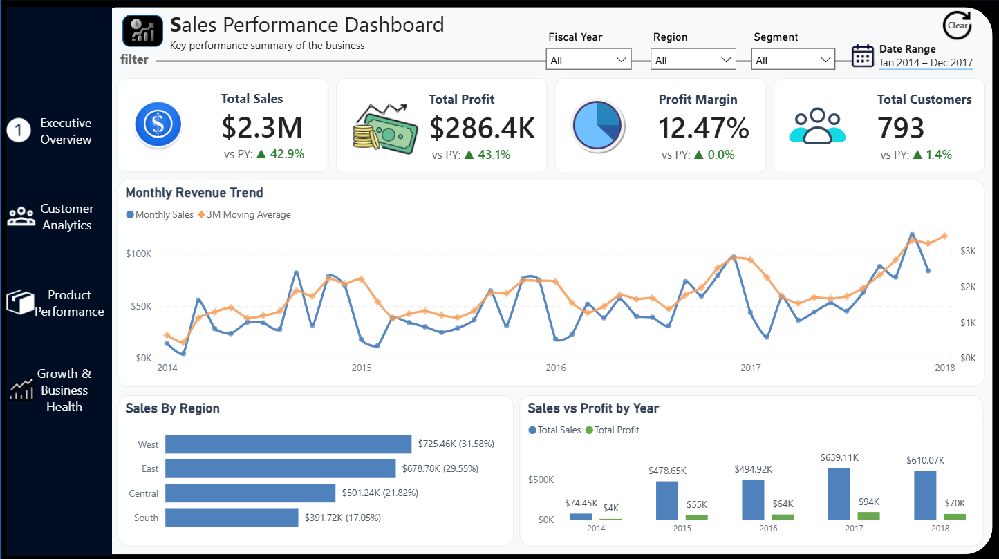
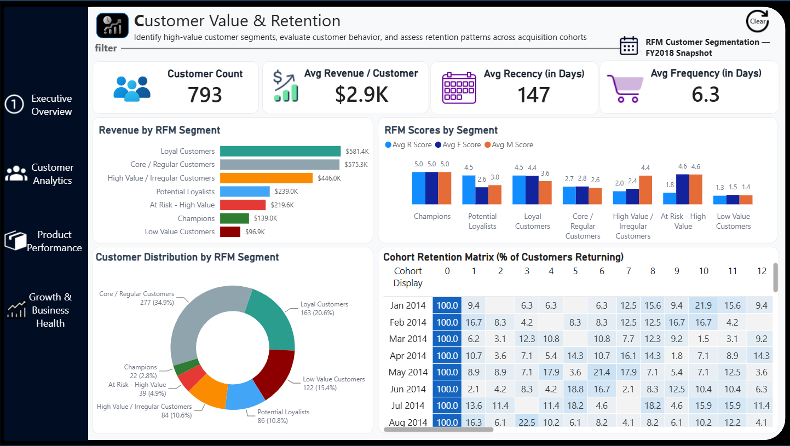
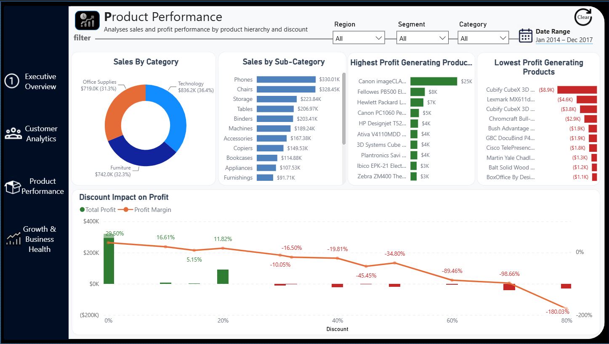
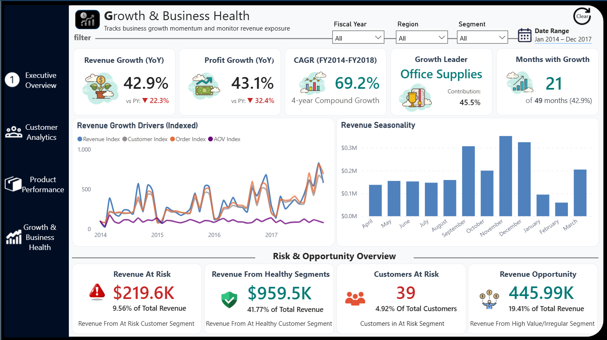

<div align="center">

#  Advanced Sales Analytics

**An end-to-end sales analytics solution built with Python, SQL Server, and Power BI, covering business performance, customer behavior, retention, profitability, growth, risk, and revenue opportunity.**

[](https://www.python.org/)
[](https://pandas.pydata.org/)
[](https://www.microsoft.com/sql-server)
[](https://powerbi.microsoft.com/)
[](LICENSE)


</div>

---

##  Table of Contents

- [Project Summary](#-project-summary)
- [Project Objective](#-project-objective)
- [Project Evolution (V1 → V2)](#-project-evolution-v1--v2)
- [Dataset](#-dataset)
- [Architecture](#-architecture)
- [Data Preparation](#-data-preparation)
- [SQL Server Layer](#-sql-server-layer)
- [Customer Analytics](#-customer-analytics)
- [Cohort Retention Analysis](#-cohort-retention-analysis)
- [Growth & Time-Series Analysis](#-growth--time-series-analysis)
- [Product & Profitability Analysis](#-product--profitability-analysis)
- [Risk & Opportunity Analysis](#-risk--opportunity-analysis)
- [Power BI Dashboard](#-power-bi-dashboard)
- [Key Insights](#-key-insights)
- [Business Recommendations](#-business-recommendations)
- [Dashboard Preview](#-dashboard-preview)
- [Documentation](#-documentation)
- [Tools & Technologies](#-tools--technologies)
- [Repository Structure](#-repository-structure)
- [Reproducing the Project](#-reproducing-the-project)
- [Limitations & Future Improvements](#-limitations--future-improvements)
- [Author](#-author)

---

##  Project Summary

This project transforms raw transactional sales data into a structured analytical solution. It began as a foundational sales analysis (V1) and was redesigned in V2 into a layered workflow covering data preparation, analytical modeling, and interactive reporting.

| | |
|:--|:--|
| **Status** | V2 completed |
| **Workflow** | Python → SQL Server → Power BI |
| **Report pages** | 4 interactive analytical pages |
| **Highlights** | RFM segmentation, cohort retention, growth-driver decomposition, discount and profitability analysis, revenue-at-risk metrics |
| **Reporting features** | Bookmark navigation, custom tooltips, dynamic data-range indicator, fiscal-year filtering |
| **Documentation** | Separate technical documents covering architecture, SQL, DAX, analytical decisions, trade-offs, and a KPI dictionary |

The repository contains both iterations:

- **V1: Sales Performance & Growth Analysis:** foundational sales analysis and reporting
- **V2: Advanced Sales Analytics:** redesigned analytical architecture with deeper customer, growth, retention, profitability, and business-health analysis

---

##  Project Objective

The goal is to transform raw transactional sales data into a reusable analytical solution that can:

- Evaluate overall business performance
- Identify sales and profitability drivers
- Analyze customer behavior and retention
- Measure business growth and momentum
- Identify revenue at risk and revenue opportunities
- Investigate the relationship between discounting and profitability
- Provide interactive dashboards for business exploration

The broader aim is to demonstrate a complete analytical workflow:

```text
Prepare → Model → Analyze → Visualize → Interpret → Recommend
```

---

##  Project Evolution (V1 → V2)

V2 was developed as an intentional extension of the original project, not a separate analysis.

| Area | V1 | V2 |
|:--|:--|:--|
| Data preparation | Basic | Python-based preparation |
| SQL | Core analysis | Structured analytical layer |
| Calendar | Basic | Fiscal-year and time-intelligence support |
| Customer analysis | Basic segmentation | RFM + cohort retention |
| Product analysis | Sales-focused | Profitability + discount analysis |
| Growth analysis | Basic YoY | Growth drivers + CAGR + seasonality |
| Risk analysis | n/a | Revenue and customer risk |
| Opportunity analysis | n/a | Revenue opportunity |
| Power BI | Core dashboard | Multi-page interactive report |
| Navigation | Basic | Bookmark-based navigation |
| Tooltips | Basic | Custom analytical tooltips |
| Documentation | README | README + technical decision documents |

V1 remains in the repository to show the progression from the original implementation to V2.

---

##  Dataset

| Property | Detail |
|:--|:--|
| **Source** | Superstore Sales Dataset |
| **Order-line records** | 9,994 |
| **Unique customers** | 793 |
| **Date range** | January 2014 – December 2017 |
| **Grain** | Order-line level |

**Primary analytical fields:** Sales, Profit, Quantity, Discount, Region, Segment, Category, Sub-Category, Product, Customer, Order Date, Ship Date.

> **Notes**
> - The data is order-line level, so the analytical grain matters when calculating customer, order, and product-level metrics.
> - The report uses fiscal-year analysis. The final fiscal period is only partially represented because the source data ends in December 2017.
> - The dataset is used for educational and portfolio purposes.

---

##  Architecture

```text
Raw Superstore Dataset
        │
        ▼
┌─────────────────────┐
│ Python              │
│ Data Preparation    │
│ & CSV Validation    │
└─────────┬───────────┘
          │
          ▼
┌─────────────────────┐
│ SQL Server          │
│                     │
│ Staging             │
│        ↓            │
│ Fact / Dimensions   │
│        ↓            │
│ Analytical Views    │
└─────────┬───────────┘
          │
          ▼
┌─────────────────────┐
│ Power BI            │
│                     │
│ Data Model + DAX    │
│        ↓            │
│ Interactive Reports │
└─────────────────────┘
```

This separation keeps data preparation, analytical modeling, and visualization responsibilities distinct, which makes the solution easier to maintain and extend.

---

##  Data Preparation

<details>
<summary><b>Initial cleaning</b></summary>
<br>

- Removing duplicate records where appropriate
- Standardizing column names
- Validating numeric fields
- Checking missing values
- Reviewing date fields
- Investigating problematic text fields

</details>

<details>
<summary><b>Python (pandas) preparation</b></summary>
<br>

- Standardizing date formats
- Handling embedded quotation marks in product names
- Preserving numeric values
- Maintaining consistent column ordering
- Exporting a UTF-8 encoded CSV
- Preparing the dataset for SQL Server bulk loading

The Python layer is kept separate from the analytical SQL layer so that data preparation and business modeling remain distinct responsibilities.

</details>

---

##  SQL Server Layer

SQL Server acts as the central analytical data layer.

| Component | Purpose |
|:--|:--|
| **Staging table** | Safely ingests cleaned source data before populating analytical tables, separating *raw ingestion → validation/transformation → analytical data* |
| **Fact table** | Retains the order-line grain for sales, profit, quantity, discount, product, and order analysis |
| **Calendar dimension** | Supports year, month, and fiscal-year analysis, YoY and MoM comparisons, time-series calculations, and cohort analysis |
| **Analytical views** | Reusable views for customer overview, RFM, revenue, risk, and cohort analysis |

Using a dedicated calendar dimension also lets Power BI time-intelligence calculations operate consistently across the report. Reusable views mean Power BI consumes structured analytical layers instead of embedding all business logic in individual visuals.

---

##  Customer Analytics

V2 introduces customer-level analysis using **RFM methodology**.

| Metric | Meaning |
|:--|:--|
| **Recency** | How recently the customer purchased |
| **Frequency** | How frequently the customer purchased |
| **Monetary** | How much revenue the customer generated |

### RFM Segments

- Champions
- Loyal Customers
- Potential Loyalists
- Core / Regular Customers
- High Value / Irregular Customers
- At Risk - High Value
- Low Value Customers

> **RFM snapshot scope:** The RFM model is a point-in-time snapshot using customer behavior up to the end of FY2018. Segments therefore represent each customer's status at the end of the available analysis period, not a recalculated historical segment for each fiscal year. The snapshot is intentionally treated separately from time-based report filtering to avoid mixing historical metrics with an FY2018 classification.

This moves the analysis beyond *"How much did each customer spend?"* toward understanding customer value and behavior.

---

##  Cohort Retention Analysis

Customers are grouped by the month of their first purchase, and their subsequent activity is tracked relative to that month.

The cohort matrix supports analysis by:

- Customer cohort
- Months since first purchase
- Cohort size
- Returning customers
- Retention rate

While RFM describes **customer value and behavior**, cohort analysis examines **retention over time**.

---

##  Growth & Time-Series Analysis

| Analysis | Description |
|:--|:--|
| Monthly sales trend | Sales over time with a 3-month moving average |
| MoM and YoY growth | Sales and profit growth comparisons |
| CAGR | Growth across FY2014–FY2018 |
| Months with growth | Count of months with positive growth |
| Revenue growth drivers | Decomposition of growth |
| Seasonality | Revenue patterns across the year |

> **CAGR note:** CAGR is calculated from FY2014 through FY2018 using the available data. Because FY2018 is only partially represented, it should not be read as a comparison of four complete fiscal years. It represents growth across the available fiscal-year periods.

**Revenue growth drivers** are decomposed using indexed measures for customer count, order count, average order value (AOV), and revenue. This shows whether growth is driven mainly by customer volume, order volume, AOV, or a combination.

---

##  Product & Profitability Analysis

- Sales by category and sub-category
- Highest and lowest profit-generating products
- Discount impact on profit
- Profit margin by discount level

The discount analysis helps identify where increased discounting is associated with declining profitability.

---

##  Risk & Opportunity Analysis

V2 adds a business-health layer connecting customer segmentation with revenue exposure.

> These are **segmentation-based indicators, not predictive churn or forecasting models.**

| Metric | Definition |
|:--|:--|
| **Revenue At Risk** | Revenue from the *At Risk - High Value* segment. Indicates exposure, not predicted churn revenue |
| **Revenue From Healthy Segments** | Revenue from segments considered healthier in value and engagement |
| **Customers At Risk** | Number of customers classified as *At Risk - High Value* |
| **Revenue Opportunity** | Revenue from the *High Value / Irregular Customers* segment. Indicates engagement potential, not forecast incremental revenue |

---

##  Power BI Dashboard

The V2 dashboard has four analytical pages.

<table>
<tr>
<td width="50%" valign="top">

**1️⃣ Executive Overview**

*KPIs:* Total Sales, Total Profit, Profit Margin, Total Customers

*Analysis:* Monthly revenue trend, 3-month moving average, sales by region, sales vs profit by year

**2️⃣ Customer Analytics**

*KPIs:* Customer Count, Average Revenue per Customer, Average Recency, Average Frequency

*Analysis:* Revenue by RFM segment, RFM scores by segment, customer distribution by segment, cohort retention matrix

</td>
<td width="50%" valign="top">

**3️⃣ Product Performance**

*Analysis:* Sales by category and sub-category, highest and lowest profit-generating products, discount impact on profit

**4️⃣ Growth & Business Health**

*Growth KPIs:* Revenue Growth (YoY), Profit Growth (YoY), CAGR (FY2014–FY2018), Growth Leader, Months with Growth

*Analysis:* Revenue growth drivers, revenue seasonality

*Risk & Opportunity:* Revenue At Risk, Revenue From Healthy Segments, Customers At Risk, Revenue Opportunity

</td>
</tr>
</table>

###  Interactive Features

- Clear-filter control
- Fiscal Year, Region, Segment, and Category filtering
- Dynamic date-range display
- Context-aware, dynamic KPI calculations
- Bookmark-based page navigation with persistent report-page context
- Report-page tooltips

**Data completeness:** The report displays the minimum and maximum dates in the current filter context. This helps users see whether an analysis covers a complete period or is affected by partial data, which matters when interpreting fiscal-year growth metrics.

###  Power BI / DAX

DAX is used for measures and interactive calculations, while reusable structural transformations are handled in SQL.

Key concepts: filter context, `CALCULATE()`, `DATEADD()`, `SAMEPERIODLASTYEAR()`, previous-period comparisons, moving averages, YoY and MoM growth, CAGR, dynamic percentages, RFM metrics, and risk and opportunity calculations.

---

##  Key Insights

- The business generated approximately **$2.3M in sales** and **$286K in profit**.
- Sales and profit grew strongly across the available period, though period completeness should be considered when interpreting fiscal-year comparisons.
- The **West region** contributes the largest share of total sales.
- **Technology** is the largest category by sales.
- A relatively small group of customers contributes a significant share of revenue.
- Certain products generate significant negative profit despite contributing to sales.
- Higher discount levels are associated with substantially lower profit margins, with some discount bands producing negative profitability.
- Customer value is concentrated across several RFM segments rather than evenly distributed.
- High-value but irregular customers represent a meaningful revenue opportunity.
- At-risk segments represent a meaningful portion of current revenue exposure.
- Retention varies substantially between cohorts and across months since first purchase.
- Revenue growth is influenced by customer count, order volume, and average order value rather than a single driver.

---

##  Business Recommendations

| Area | Recommendation |
|:--|:--|
| **Protect high-value customers** | Prioritize retention efforts for customers classified as At Risk - High Value |
| **Engage irregular high-value customers** | Develop targeted engagement strategies for customers with strong monetary value but inconsistent purchasing |
| **Review aggressive discounting** | Investigate high-discount transactions and sub-categories where discounting is associated with negative profit |
| **Protect strong regions** | Continue monitoring the West region given its contribution to total sales |
| **Investigate loss-making products** | Review pricing, cost structure, and discount policies for products with persistent negative profit |
| **Monitor growth drivers** | Track whether growth comes from customer acquisition, order volume, or higher order value |
| **Account for data completeness** | Consider historical coverage when comparing fiscal periods and interpreting growth |

---

##  Dashboard Preview

### Executive Overview


### Customer Value & Retention


### Product Performance


### Growth & Business Health


---

##  Documentation

V2 includes separate documents explaining the reasoning behind the project's architecture, SQL design, and Power BI implementation. They are in [`06_Docs/`](06_Docs/):

| Document | Description |
|:--|:--|
| [Architecture](06_Docs/01_Architecture.md) | Project architecture and data flow |
| [SQL Decisions](06_Docs/02_SQL_Decisions.md) | SQL Server modeling and analytical decisions |
| [Power BI & DAX Decisions](06_Docs/03_PowerBI_DAX_Decisions.md) | Reporting, DAX, and dashboard design decisions |
| [Analytical Decisions](06_Docs/04_Analytical_Decisions.md) | Reasoning behind the analytical methods used |
| [Trade-offs & Limitations](06_Docs/05_Tradeoffs_Limitations.md) | Limitations, compromises, and future extensions |
| [KPI Dictionary](06_Docs/06_KPI_Dictionary.md) | Definitions and calculation logic for dashboard KPIs |

<details>
<summary><b>Topics covered in the technical documents</b></summary>
<br>

- Why Python was introduced into the pipeline
- Why SQL Server was used as the analytical layer
- Why staging tables were used
- Fact-table grain considerations
- Calendar dimension design
- SQL views and analytical-layer separation
- RFM implementation and cohort-analysis design
- DAX and Power BI modeling decisions
- Fiscal-year implementation and time-intelligence considerations
- Bookmark, navigation, tooltip, and report-interaction decisions

</details>

---

##  Tools & Technologies

| Tool | Purpose |
|:--|:--|
| **Python / Pandas** | Data cleaning and preparation |
| **SQL Server** | Data storage, transformation, and analytical modeling |
| **Power BI** | Data modeling, DAX, visualization, and dashboard development |
| **Excel** | Initial data inspection and validation |
| **Git / GitHub** | Version control and project documentation |

---

##  Repository Structure

```text
AdvancedSalesAnalytics/
│
├── 01_Data/            # Raw and prepared datasets
├── 02_Python/
│   ├── V1/
│   └── V2/
├── 03_SQL/
│   ├── V1/
│   └── V2/
├── 04_PowerBI/
│   ├── V1/
│   └── V2/
├── 05_Images/
│   ├── V1/
│   └── V2/
├── 06_Docs/            # Design decisions & KPI dictionary
│
├── .gitignore
├── requirements.txt
├── LICENSE
└── README.md
```

Shared resources may remain at the top level where separation between V1 and V2 is unnecessary.

---

##  Reproducing the Project

1. **Prepare the data:** Run the Python preparation script in `02_Python/V2/`.
2. **Load into SQL Server:** Create the `AdvancedSalesAnalytics` database and run the scripts in `03_SQL/V2/` in the required order.
3. **Connect Power BI:** Open the V2 report in `04_PowerBI/V2/` and point the SQL Server connection to your local `AdvancedSalesAnalytics` database.
4. **Explore the report:** Use the navigation and filters to explore the analytical pages.

---

##  Limitations & Future Improvements

**Current limitations**
- The final fiscal period is partially represented, which affects growth and CAGR interpretation.
- RFM is a single point-in-time snapshot rather than a per-year segmentation.
- Risk and opportunity metrics are segmentation-based, not predictive.

**Potential extensions** *(outside the current scope of V2)*
- Automated data refresh and pipeline execution
- Automated data-quality validation
- Customer lifetime value analysis
- Revenue forecasting
- Additional retention metrics

---


---

##  Author

**[Shivam]**
Data Analyst | SQL · Python · Power BI

